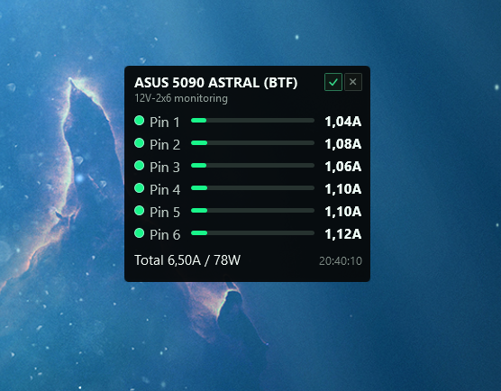

# Astral Pin Widget



Compact Windows desktop widget for monitoring ASUS RTX 5090 ASTRAL / ASTRAL BTF 12V-2x6 connector pin current.

The project is a small C# WPF application that reads ASUS GPU Tweak III telemetry directly and displays each of the six 12V-2x6 power pins in a minimal always-on-top overlay.

> This is an unofficial, read-only monitoring tool. It does not control GPU power limits, voltages, fans, clocks, BIOS settings, or any safety mechanisms.

## Purpose

Modern high-end GPUs can draw a large amount of power through the 12VHPWR / 12V-2x6 connector. On ASUS RTX 5090 ASTRAL cards, GPU Tweak III can show Power Detector+ per-pin current. This widget extracts the same kind of telemetry and keeps it visible on the desktop without opening the full GPU Tweak III or HWiNFO sensor window.

The goal is:

- show all six 12V-2x6 pin currents at a glance;
- make uneven pin load visible quickly;
- show total connector current and estimated watts;
- stay small enough to live on the desktop as a widget;
- preserve widget position between launches;
- avoid depending on HWiNFO shared memory or registry exports.

## Features

- Per-pin current display for Pin 1 through Pin 6.
- Total connector current and estimated power.
- Compact horizontal load bar for each pin.
- Load bar normalized to a 600W connector budget.
- Per-pin state indicator.
- Voltage tooltip when hovering over the current value.
- Status tooltip when hovering over the pin indicator.
- Always-on-top toggle in the widget header.
- Close button in the widget header.
- Drag-to-move borderless window.
- Double-click refresh.
- Right-click context menu with refresh, always-on-top, and exit.
- Window position and topmost setting are saved and restored.

## Telemetry source

The widget reads ASUS GPU Tweak III directly. It does not read from HWiNFO.

The investigated telemetry path is:

1. ASUS GPU Tweak III is installed under:

   ```text
   C:\Program Files (x86)\ASUS\GPUTweakIII
   ```

2. `ExpanModule.dll` exports the function used by the widget:

   ```csharp
   Expan_Api_GetPowerStatus
   ```

3. `ExpanModule.dll` contains Power Detector+ related strings, including:

   ```text
   CARD 12V-2X6
   Pin 1: 0.00A
   Pin 2: 0.00A
   Power Detector+
   CPowerDetect
   CIT8915_V2
   ```

4. ASUS ships supporting native DLLs such as:

   - `ITECCTdll.dll` - ITE HID custom command DLL.
   - `EIO.dll` - ASUS I2C / low-level IO support.
   - `IOMap.sys` / `IOMap64.sys` - ASUS low-level driver references.

The card appears in HWiNFO as an ITE telemetry source, for example:

```text
dGPU [#0]: NVIDIA GeForce RTX 5090: ITE IT8915FN
```

That HWiNFO view is useful for validation, but this project does not require HWiNFO.

## Native contract

The tested native call is a 32-bit cdecl export from `ExpanModule.dll`:

```csharp
[DllImport("ExpanModule.dll", CallingConvention = CallingConvention.Cdecl)]
private static extern int Expan_Api_GetPowerStatus(int cardId, ref NativePowerStatus status);
```

The tested output structure is:

```csharp
[StructLayout(LayoutKind.Sequential)]
private struct NativePowerStatus
{
    public float Pin1;
    public float Pin2;
    public float Pin3;
    public float Pin4;
    public float Pin5;
    public float Pin6;
    public float Pin7;
    public float Pin8;
    public float Pin9;
    public float Pin10;
    public float TotalCurrentAmps;
    public int HardwareAlert;
    public int Count;
}
```

Observed layout:

- offsets `0x00..0x24`: up to 10 float current slots;
- first 6 slots are used for the 12V-2x6 pins on this card;
- offset `0x28`: total connector current in amps;
- offset `0x2C`: hardware alert / status integer;
- offset `0x30`: active pin count.

The WPF app is forced to run as x86 because ASUS ships a 32-bit `ExpanModule.dll`. Before calling the export, the app sets the DLL directory to the GPU Tweak III installation folder so ASUS / ITE dependencies resolve correctly.

## Power and bar scaling

GPU Tweak's tested power-status call exposes per-pin current. The widget currently uses nominal `12.00V` for displayed voltage and power estimation.

Total watts are calculated as:

```text
sum(pin_voltage * pin_current)
```

With the current nominal voltage model:

```text
total_watts = total_current_amps * 12.0
```

The per-pin load bar is normalized to a 600W connector budget:

```text
600W / 12V / 6 pins = 8.33A per pin
```

So a pin drawing about `2.8A` is displayed at roughly one third of the bar, not as a full load.

## Limitations

- Only tested against the installed ASUS GPU Tweak III version and an ASUS RTX 5090 ASTRAL / ASTRAL BTF environment.
- The ASUS native API is undocumented and may change between GPU Tweak III releases.
- The app must run as x86.
- Per-pin voltage is currently displayed as nominal `12.00V`; the confirmed ASUS call used here returns per-pin current, not measured per-pin voltage.
- Total watts are estimated from current and nominal 12V rail voltage.
- This is a monitoring overlay, not a replacement for electrical inspection, cable inspection, or vendor safety warnings.

## What is required for the widget to work

The widget is not a standalone hardware driver. It relies on ASUS GPU Tweak III native components already installed on the system.

Required:

- Windows 10 / Windows 11.
- ASUS GPU Tweak III installed.
- ASUS GPU Tweak III installation folder containing `ExpanModule.dll`.
- ASUS / ITE low-level components installed by GPU Tweak III, including the DLLs and drivers required by ASUS Power Detector+ telemetry.
- Supported ASUS GPU with 12V-2x6 / 12VHPWR Power Detector+ telemetry.
- Tested target: ASUS RTX 5090 ASTRAL / ASTRAL BTF with ITE IT8915FN telemetry.
- .NET 8 Desktop Runtime to run the compiled widget, or .NET 8 SDK to build it.
- x86 process support. The project is configured as x86 because ASUS ships the required `ExpanModule.dll` as a 32-bit binary.

Not required:

- HWiNFO.
- HWiNFO shared memory.
- HWiNFO registry sensor export.
- NVIDIA Management Library / NVML for per-pin current.
- Running the full GPU Tweak III UI window, as long as the ASUS native components and drivers are installed and available.

If the widget starts but shows no telemetry, check these first:

- GPU Tweak III is installed correctly.
- `C:\Program Files (x86)\ASUS\GPUTweakIII\ExpanModule.dll` exists.
- GPU Tweak III itself can show Power Detector+ / 12V-2x6 pin data for the card.
- The widget is running as x86.
- Security software is not blocking ASUS low-level DLL or driver access.

## Build

```powershell
dotnet build .\src\AstralPinWidget.sln -c Release
```

## Run

```powershell
.\src\AstralPinWidget\bin\Release\net8.0-windows\AstralPinWidget.exe
```

The window is borderless and can be dragged by holding the widget body.

## Settings

Widget settings are stored under the current user's application data folder:

```text
%APPDATA%\AstralPinWidget\settings.json
```

Stored settings:

- window left position;
- window top position;
- always-on-top state.

The position is saved after moving the widget and restored on the next launch.

## Project structure

```text
README.md
assets/
  Preview.png
src/
  AstralPinWidget.sln
  AstralPinWidget/
    AstralPinWidget.csproj
    App.xaml
    MainWindow.xaml
    MainWindow.xaml.cs
    Models/
      PinPowerReading.cs
      PinPowerSnapshot.cs
    Native/
      NativeWindowStyles.cs
    Services/
      GpuTweakPowerProvider.cs
      IPinPowerProvider.cs
      WindowSettingsStore.cs
    ViewModels/
      MainWindowViewModel.cs
      PinSeverity.cs
      PinViewModel.cs
      ObservableObject.cs
      RelayCommand.cs
  tools/
    GpuTweakProbe/
```

`src/tools/GpuTweakProbe` is a diagnostic console probe used to validate the ASUS native export and structure layout. It is excluded from the WPF project build.

## Safety notes

This tool only reads telemetry. It cannot guarantee that a connector, cable, PSU, adapter, or GPU is safe. If you see abnormal current distribution, hardware alerts, melting smell, connector discoloration, unstable power readings, or system instability, shut the system down and inspect the hardware according to ASUS / NVIDIA / PSU vendor guidance.

## License

This repository is licensed under the MIT License.

That means the project is available for almost any use, including private use, commercial use, modification, distribution, sublicensing, and selling copies, as long as the copyright notice and license text are preserved. See [LICENSE](LICENSE).

---

# Astral Pin Widget

Компактный Windows-виджет для мониторинга тока по пинам 12V-2x6 на ASUS RTX 5090 ASTRAL / ASTRAL BTF.

Проект представляет собой небольшое C# WPF-приложение, которое напрямую читает телеметрию ASUS GPU Tweak III и показывает шесть силовых пинов 12V-2x6 в минимальном overlay-окне поверх рабочего стола.

> Это неофициальный инструмент только для чтения. Он не управляет лимитами питания, напряжениями, вентиляторами, частотами, BIOS, защитами или другими настройками видеокарты.

## Цель

Современные топовые видеокарты могут потреблять много мощности через 12VHPWR / 12V-2x6. На ASUS RTX 5090 ASTRAL утилита GPU Tweak III показывает Power Detector+ с током по каждому пину. Этот виджет получает аналогичную телеметрию и держит ее на экране без необходимости открывать полный GPU Tweak III или окно сенсоров HWiNFO.

Задачи проекта:

- показывать ток всех шести пинов 12V-2x6;
- быстро замечать неравномерную нагрузку между пинами;
- показывать суммарный ток коннектора и расчетные ватты;
- оставаться маленьким desktop-виджетом;
- запоминать позицию окна между запусками;
- не зависеть от HWiNFO shared memory или registry export.

## Возможности

- Отображение тока Pin 1 - Pin 6.
- Суммарный ток коннектора и расчетная мощность.
- Компактная горизонтальная полоска нагрузки для каждого пина.
- Полоска нагрузки нормализована относительно 600W лимита.
- Индикатор состояния каждого пина.
- Подсказка с напряжением при наведении на значение тока.
- Подсказка со статусом при наведении на индикатор пина.
- Переключатель "поверх всех окон" в шапке.
- Кнопка закрытия в шапке.
- Окно без рамки, перетаскивается мышью.
- Обновление по двойному клику.
- Контекстное меню по правому клику.
- Сохранение позиции окна и состояния always-on-top.

## Источник телеметрии

Виджет читает данные напрямую из ASUS GPU Tweak III. HWiNFO не используется.

Исследованный путь телеметрии:

1. ASUS GPU Tweak III установлен в:

   ```text
   C:\Program Files (x86)\ASUS\GPUTweakIII
   ```

2. `ExpanModule.dll` экспортирует функцию, которую вызывает виджет:

   ```csharp
   Expan_Api_GetPowerStatus
   ```

3. В `ExpanModule.dll` найдены строки, связанные с Power Detector+:

   ```text
   CARD 12V-2X6
   Pin 1: 0.00A
   Pin 2: 0.00A
   Power Detector+
   CPowerDetect
   CIT8915_V2
   ```

4. В поставке ASUS также есть нативные DLL:

   - `ITECCTdll.dll` - ITE HID custom command DLL.
   - `EIO.dll` - ASUS I2C / low-level IO.
   - `IOMap.sys` / `IOMap64.sys` - ссылки на низкоуровневый ASUS-драйвер.

В HWiNFO эта телеметрия может отображаться как ITE-источник, например:

```text
dGPU [#0]: NVIDIA GeForce RTX 5090: ITE IT8915FN
```

Скриншот HWiNFO полезен для проверки значений, но для работы проекта HWiNFO не нужен.

## Нативный контракт

Проверенный вызов - 32-битный cdecl export из `ExpanModule.dll`:

```csharp
[DllImport("ExpanModule.dll", CallingConvention = CallingConvention.Cdecl)]
private static extern int Expan_Api_GetPowerStatus(int cardId, ref NativePowerStatus status);
```

Проверенная структура результата:

```csharp
[StructLayout(LayoutKind.Sequential)]
private struct NativePowerStatus
{
    public float Pin1;
    public float Pin2;
    public float Pin3;
    public float Pin4;
    public float Pin5;
    public float Pin6;
    public float Pin7;
    public float Pin8;
    public float Pin9;
    public float Pin10;
    public float TotalCurrentAmps;
    public int HardwareAlert;
    public int Count;
}
```

Наблюдаемая раскладка:

- offsets `0x00..0x24`: до 10 float-слотов тока;
- первые 6 слотов используются как пины 12V-2x6;
- offset `0x28`: суммарный ток коннектора в амперах;
- offset `0x2C`: hardware alert / status integer;
- offset `0x30`: количество активных пинов.

WPF-приложение принудительно собирается и запускается как x86, потому что ASUS поставляет `ExpanModule.dll` в 32-битном виде. Перед вызовом export приложение выставляет DLL directory на папку GPU Tweak III, чтобы корректно загрузились зависимости ASUS / ITE.

## Мощность и шкала нагрузки

Проверенный ASUS power-status вызов возвращает ток по пинам. Напряжение в интерфейсе сейчас отображается как номинальные `12.00V`.

Ватты считаются так:

```text
sum(pin_voltage * pin_current)
```

При текущей модели с номинальным напряжением:

```text
total_watts = total_current_amps * 12.0
```

Полоска нагрузки пина нормализована относительно 600W бюджета коннектора:

```text
600W / 12V / 6 pins = 8.33A на пин
```

То есть пин с током около `2.8A` будет показываться примерно на треть шкалы, а не как почти полная нагрузка.

## Ограничения

- Проверено только на установленной версии ASUS GPU Tweak III и окружении ASUS RTX 5090 ASTRAL / ASTRAL BTF.
- Нативный ASUS API не документирован и может измениться в новых версиях GPU Tweak III.
- Приложение должно запускаться как x86.
- Напряжение по пинам сейчас отображается как номинальные `12.00V`; подтвержденный ASUS-вызов возвращает ток, а не измеренное напряжение по каждому пину.
- Ватты являются расчетными: ток умножается на номинальное напряжение 12V.
- Это overlay-монитор, а не замена осмотру коннектора, кабеля, блока питания или рекомендациям производителя.

## Что нужно для работы виджета

Виджет не является самостоятельным драйвером для железа. Он использует нативные компоненты ASUS GPU Tweak III, которые уже должны быть установлены в системе.

Обязательно нужно:

- Windows 10 / Windows 11.
- Установленный ASUS GPU Tweak III.
- Папка установки GPU Tweak III с файлом `ExpanModule.dll`.
- Низкоуровневые ASUS / ITE компоненты, которые ставятся вместе с GPU Tweak III и нужны для Power Detector+ телеметрии.
- Поддерживаемая ASUS-видеокарта с 12V-2x6 / 12VHPWR Power Detector+ телеметрией.
- Проверенная цель: ASUS RTX 5090 ASTRAL / ASTRAL BTF с ITE IT8915FN телеметрией.
- .NET 8 Desktop Runtime для запуска готового виджета или .NET 8 SDK для сборки.
- Поддержка x86-процесса. Проект настроен как x86, потому что нужный ASUS `ExpanModule.dll` является 32-битным.

Не нужно:

- HWiNFO.
- HWiNFO shared memory.
- HWiNFO registry sensor export.
- NVIDIA Management Library / NVML для тока по пинам.
- Открытое окно GPU Tweak III, если ASUS native-компоненты и драйверы установлены и доступны.

Если виджет запускается, но не показывает телеметрию, сначала проверьте:

- GPU Tweak III установлен корректно.
- Файл `C:\Program Files (x86)\ASUS\GPUTweakIII\ExpanModule.dll` существует.
- Сам GPU Tweak III показывает Power Detector+ / 12V-2x6 pin data для видеокарты.
- Виджет запущен как x86.
- Антивирус или security software не блокирует доступ к низкоуровневым ASUS DLL/драйверам.

## Сборка

```powershell
dotnet build .\src\AstralPinWidget.sln -c Release
```

## Запуск

```powershell
.\src\AstralPinWidget\bin\Release\net8.0-windows\AstralPinWidget.exe
```

Окно без рамки, его можно перетаскивать мышью за тело виджета.

## Настройки

Настройки виджета хранятся в профиле пользователя:

```text
%APPDATA%\AstralPinWidget\settings.json
```

Сохраняется:

- позиция окна по X;
- позиция окна по Y;
- состояние always-on-top.

Позиция сохраняется после перемещения виджета и восстанавливается при следующем запуске.

## Структура проекта

```text
README.md
assets/
  Preview.png
src/
  AstralPinWidget.sln
  AstralPinWidget/
    AstralPinWidget.csproj
    App.xaml
    MainWindow.xaml
    MainWindow.xaml.cs
    Models/
      PinPowerReading.cs
      PinPowerSnapshot.cs
    Native/
      NativeWindowStyles.cs
    Services/
      GpuTweakPowerProvider.cs
      IPinPowerProvider.cs
      WindowSettingsStore.cs
    ViewModels/
      MainWindowViewModel.cs
      PinSeverity.cs
      PinViewModel.cs
      ObservableObject.cs
      RelayCommand.cs
  tools/
    GpuTweakProbe/
```

`src/tools/GpuTweakProbe` - диагностическая консольная утилита, которая использовалась для проверки ASUS export и структуры данных. Она исключена из сборки WPF-проекта.

## Безопасность

Этот инструмент только читает телеметрию. Он не может гарантировать безопасность коннектора, кабеля, блока питания, переходника или видеокарты. Если видна странная разбалансировка токов, hardware alert, запах гари, потемнение коннектора, нестабильные значения или проблемы со стабильностью системы, выключите компьютер и проверьте железо согласно рекомендациям ASUS / NVIDIA / производителя блока питания.

## Лицензия

Репозиторий распространяется под лицензией MIT.

Это означает, что проект доступен практически для любых действий: личного использования, коммерческого использования, изменения, распространения, сублицензирования и продажи копий, если сохраняется текст лицензии и copyright notice. См. [LICENSE](LICENSE).
